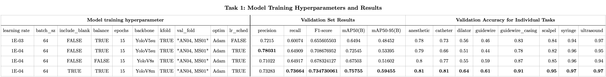
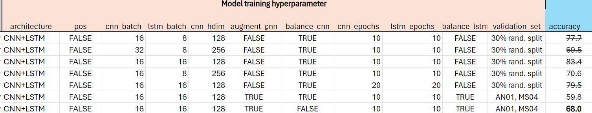

# Challenge_Code

This repository should include all materials needed to reproduce your results file. Please fill in the following sections to describe your approach to the challenge and how to set up your environment and run your code. Minimum questions to be answered are listed in each section, but feel free to add more details beyond what's listed. The information included in this file, is also what is expected in your final results presentation.

This ReadME file must be complete by the results presentation on May 8th, 2024 to be eligible for awards.

Winning teams (for each subtask and overall) will have their submission featured in the Winning_Strategies repository on the main challenge page for all future participants to see.

## Team members:

Faranak Akbarifar, Dashti Ali, Rina Khan, Hemangini Shashikant Patel, Mohamed Harmanani

## Setup:

How did you set up your environment? Include detailed steps. If you used the environment that was provided, you may simply refer back to the original challenge page.  
If you used the provided environment, did you install any additional libraries? Include steps for installation (can be a link to existing documentation)

```
cd Desktop/Central_Line_Challenge
bash # conda does not work otherwise
conda activate chal24
```

## Strategy:

#### General approach

> How did you approach the challenge overall? Did you target one particular subtask over the others?

We focused on tool detection for the first week by allocating two team members (Mohamed and Dashti) to that task, while also having two other members work on Tasks 2 (Rina) and 3 (Faranak) in a more limited capacity (understanding code, brainstorming ideas, running code on CPU). Every week, we shifted the focus to the next task, and had members who were previously working on a previous support the ones working on the current task of interest. During that week, the GPU would be freed to train models pertaining to the current task of interest.

> How did you divide the work to be done amongst all team members?

We wanted to assign tasks to members which could reasonably complete them while also learning something new/interesting/worthwile for them. For instance, Rina expressed being unfamiliar with task recognition and sequence learning models (LSTM, BERT, etc...) but was willing to give it a shot and volunteered to work on this task.

Dashti worked on Task 1 for the first week and Task 2 for weeks 2 and 3, and Faranak was familiar with foundation models so she was assigned Task 3. Gini expressed not having a strong understanding of deep learning and was more interested in data-related tasks and analyzing the output of the models to understand how they work at a high-level and guide our overall strategy for certain tasks (mainly Task 1).

Mohamed helped Dashti with model training for the first week and supervised the progress on remaining tasks. They also wrote code to make other members' lives easier such as better data splitting, k-fold cross-validation, automated metrics, etc.. They trained a few models as well when the GPU was free at odd hours.

How did you make use of the resources provided (e.g. base-line code)

We did not want to write too much unnecessary code and focused on having low-code-high-impact solutions (e.g. hyperparameter tuning).

#### Sub-task 1: Tool detection

> What was your general strategy for approaching this subtask?

We first trained the baseline for Task 1 using leave-one-center-out (2 centers where used as holdouts 1 AN 1 MS). We then began tuning our hyperparameters as shown below, and once we got an idea of the expected performance, we trained YoloV8-S and YoloV8-M models and drastically improved on our validation metrics.



> How did you decide to split the data for training?

We implemented leave-one-video-out and used two videos as a holdout set. We chose 1 AN video and 1 MS video to have a diverse validation set (we observed that having only one video was not representative of performance on the other video).

> How much time did you dedicate to this task (approximately)?

1 week

> Results:
```
Sub-task 1 Results:
	mAP (IoU 50%): 0.36670459607620653
	mAP (IoU 75%): 0.14831097024773499
	mAP (IoU 90%): 0.0035363134772766493
```

#### Sub-task 2: Workflow recognition

We started with the baseline CNN + LSTM model and trained it with default parameters for 10 epochs for CNN and LSTM each. We then began fine tuning our parameters. The figure below shows the relevant hyperparameters we used in our sweep. The accuracy numbers reflect validation accuracy. Initially our metrics were inflated due to us using a random 70-30 split in data, leading to highly imbalanced train-validation data split. We observed more modest results once we also used a leave-one-videwo-out and used two videos for the validation holdout set.



We wanted to see if the results could be further improved, and we came up with the idea of replacing the LSTM layer with a transformer. After some brainstorming we implemented BERT. This took more time than we expected as we faced some difficulties getting the model to work, which cut into our training time. We trained three different hyperparameter combinations for the CNN + BERT model but found that validation accuracy did not surpass our CNN and LSTM implementation.

> Results:
```
Sub-task 2 Results:
	Overall accuracy: 0.32
	Average precision: 0.1
	Average recall: 0.13
	Starting transitional delay: 0.95
	End transitional delay: 0.96
	Confusion matrix:
[[ 136    0    0    0    0    0    0 3016    0    0]
 [   0    0    0    0    0    0    0  851    0    0]
 [   2    0    0    0    0    0    0  419    0    0]
 [   0    0    0    0    0    0    0  370    0    0]
 [   0    0    0    0    0    0    0 1662    0    0]
 [   0    0    0    0    0    0    0 1209    0    0]
 [   0    0    0    0    0    0    0 3745    0    0]
 [   0    0    0    0    0    0    0 5217    0    0]
 [   0    0    0    0    0    0    0   67    0    0]
 [   0    0    0    0    0    0    0  177    0    0]]

```

#### Sub-task 3: Ultrasound segmentation
> What was your general strategy for approaching this subtask?

We first decided on trying SAM for the single-object segmentation task. We started by running some tutorials showing its caabilities as a prompted segmentation foundation model, and some tutorials trying to finetune it on multiple small public datasets. From these, we got an understanding on how to use SAM for a single-purpose segmentation model: Use it with prompts to generate ground-truth segmentation masks, and fine-tune it without prompts using a small subset of video frames (learning rate, batch size, size and selection of the fine-tuning dataset).

> Which foundation model did you use and why?  

We used SAM with vit-b encoder since we have already heard about its performance on generating automatic segmentation masks on natural images. We used the bounding boxes of ultrasound probe, provided in the labels file, as prompts and used the original SAM weights to generate our label masks. We identified some faulty masks in frames without an ultrasound label and manually set them to zero. We used these labels in the fine-tuning process.

> Did you fine-tune the model? If so, how did you do this?

We performed a no-prompt decoder-only fine-tuning process on small subsets of data, starting from 100 frames and ended up creating the final model using 3500 frames. We selected the random frames uniformly from all videos (except AN04 and SM01-saved for testing), ensuring that the final selection contains the same ratio of no-ultrasound images as the whole dataset.

> Did you make use of the existing labels? If so, how did you incorporate them?

We used the provided bounding boxes as prompts and generated the ground-truth segmentation masks.

> Did you use any preprocessing or postprocessing? If so, what?  

Dynamic range of the inputs were compressed using percentile clipping, inputs were normalized, zero pixels of the original image were maintained, images were resized for the SAM encoder.

> How much time did you dedicate to this task (approximately)?  

1 week

> Results:

```
Sub-task 3 Results:
	Average Dice: 0.47
	Average Hausdorff distance: 0.186
```


## Training the networks:

Note that your networks must take in the dataset using the same csv format as the baseline networks provided. No restructuring of the data folders is permitted.

#### Sub-task 1: Tool detection

Run `Tool Detection/Train_YOLOv5.py` specifying the `--data-csv-file` and `--save-location` along with the designated parameters.

#### Sub-task 2: Task Recognition

Run `Task Recognition/Train_CNN_LSTM.py` specifying the `--data-csv-file` and `--save-location` along with the designated parameters.

#### Sub-task 3: Ultrasound probe segmentation
Using "select_preprocess.py" the same subset of data we used for training the final model can be created and preprocessed. Training using "finetune_and_inference_tutorial.py" with this dataset, creates the model that is also uploaded as "sam_model_best.pth".

Include steps to reproduce your trained network

## Generating test predictions

Note that your code must take in the dataset using the same csv format as the baseline networks provided and produce results that are correctly formatted for submission. No restructuring of the data folders is permitted.

#### Sub-task 1: Tool detection

Run `Tool Detection/generateTestResults.py` with `--data-csv-file` correctly set and `--save-location` set to where the model path is located.

#### Sub-task 2: Task Recognition

Run `Task Detection/generateTestResults.py` with `--data-csv-file` correctly set and `--save-location` set to where the model path is located.

#### Sub-task 3: Ultrasound probe segmentation
Using "inference.py" with the default arguments the same test predictions can be created.

## Our results

```
Results for Group 3:

Sub-task 1 Results:
	mAP (IoU 50%): 0.36670459607620653
	mAP (IoU 75%): 0.14831097024773499
	mAP (IoU 90%): 0.0035363134772766493

Sub-task 2 Results:
	Overall accuracy: 0.32
	Average precision: 0.1
	Average recall: 0.13
	Starting transitional delay: 0.95
	End transitional delay: 0.96
	Confusion matrix:
[[ 136    0    0    0    0    0    0 3016    0    0]
 [   0    0    0    0    0    0    0  851    0    0]
 [   2    0    0    0    0    0    0  419    0    0]
 [   0    0    0    0    0    0    0  370    0    0]
 [   0    0    0    0    0    0    0 1662    0    0]
 [   0    0    0    0    0    0    0 1209    0    0]
 [   0    0    0    0    0    0    0 3745    0    0]
 [   0    0    0    0    0    0    0 5217    0    0]
 [   0    0    0    0    0    0    0   67    0    0]
 [   0    0    0    0    0    0    0  177    0    0]]

Sub-task 3 Results:
	Average Dice: 0.47
	Average Hausdorff distance: 0.186

Sub-task 1 overall results: 0.5185518798012182
Sub-task 2 overall results: -0.4049999999999999
Sub-task 3 overall results: 0.284
Unlabelled data score: 0/160

Overall score = 0.3*0.5185518798012182 + 0.3*-0.4049999999999999 + 0.3*0.284 + 0.1*(0/160)
Overall score = 0.119
```

## Final reflections

Overall, I think we did our best with the time we had. Unfortunately task 2 results were not very good, but we are happy with the effort we put in and the results we did manage on Task 1 and 3. I think instead of spending time on the transformer implementation for task 2, we could have better spent that time on refining our LSTM model. If we had more capacity, we should have spent more time studying the data. But again, we did our best and are happy with what we achieved.

